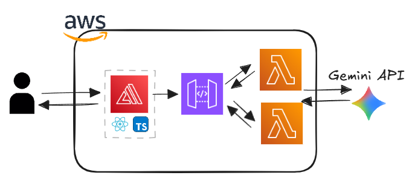
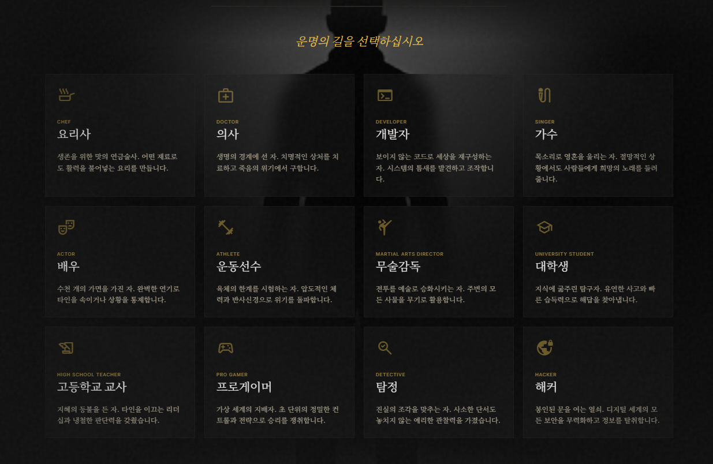
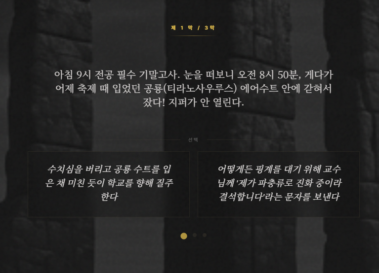
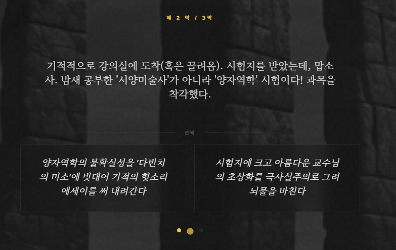
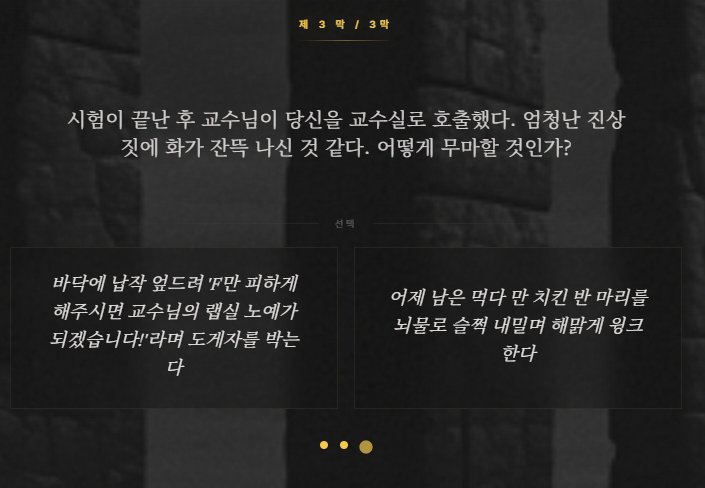
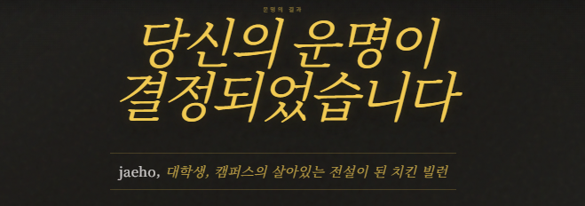
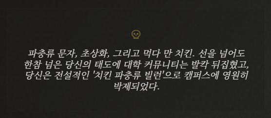

# THE AUTEUR

> **AI 역량 검증 토이 프로젝트** — Design AI · Coding AI · LLM API를 한 사이클로 묶어 구현한 시네마틱 인터랙티브 소설 웹앱

<br>

## How It Was Built

이 프로젝트는 세 가지 AI 도구를 단계적으로 활용해 만들어졌습니다.

| 단계 | 도구 | 역할 |
|------|------|------|
| 1 | **Google Stitch** | UI 디자인 시스템 · 화면 레이아웃 생성 |
| 2 | **Claude Code** | Stitch 산출물 기반 React 코드 구현 |
| 3 | **Gemini 2.5 Flash API** | 장르·캐릭터 맞춤 스토리 런타임 생성 |

<br>

## Architecture

<p align="center">
  
</p>

- **AWS Amplify** — React/Vite 정적 호스팅
- **API Gateway + Lambda** — Gemini API 프록시 (키 노출 방지)
- **Gemini 2.5 Flash** — 3막 구조 스토리 · 최종 결말 생성

<br>

## Flow

장르와 직업을 선택하면 AI가 3막 구조의 스토리를 한 번에 생성합니다.  
사용자는 각 막마다 두 가지 선택지 중 하나를 고르고, 마지막 선택 후 선택의 조합에 따른 결말을 받습니다.

<table>
  <tr>
    <td align="center"><b>장르 선택</b></td>
    <td align="center"><b>직업 선택</b></td>
  </tr>
  <tr>
    <td></td>
    <td></td>
  </tr>
</table>

<table>
  <tr>
    <td align="center"><b>1막</b></td>
    <td align="center"><b>2막</b></td>
    <td align="center"><b>3막</b></td>
  </tr>
  <tr>
    <td></td>
    <td></td>
    <td></td>
  </tr>
</table>

<table>
  <tr>
    <td align="center" colspan="2"><b>결말</b></td>
  </tr>
  <tr>
    <td></td>
    <td></td>
  </tr>
</table>

<br>

## Tech Stack

```
React 18 · TypeScript · Vite · Tailwind CSS
AWS Amplify · API Gateway · Lambda (Node.js 20)
Gemini 2.5 Flash
```

<br>

## Quick Start

```bash
npm install --ignore-scripts
node node_modules/esbuild/install.js

# .env
VITE_API_BASE_URL=<API Gateway URL>

npm run dev
```
